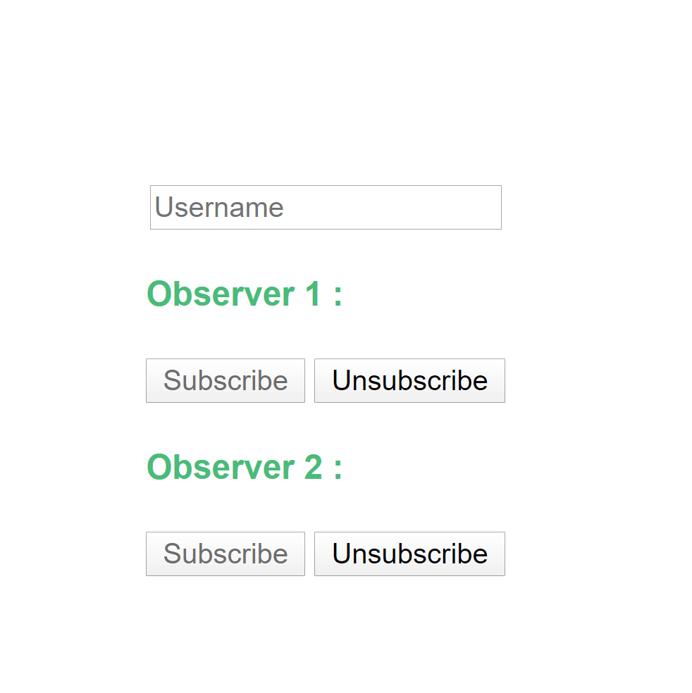
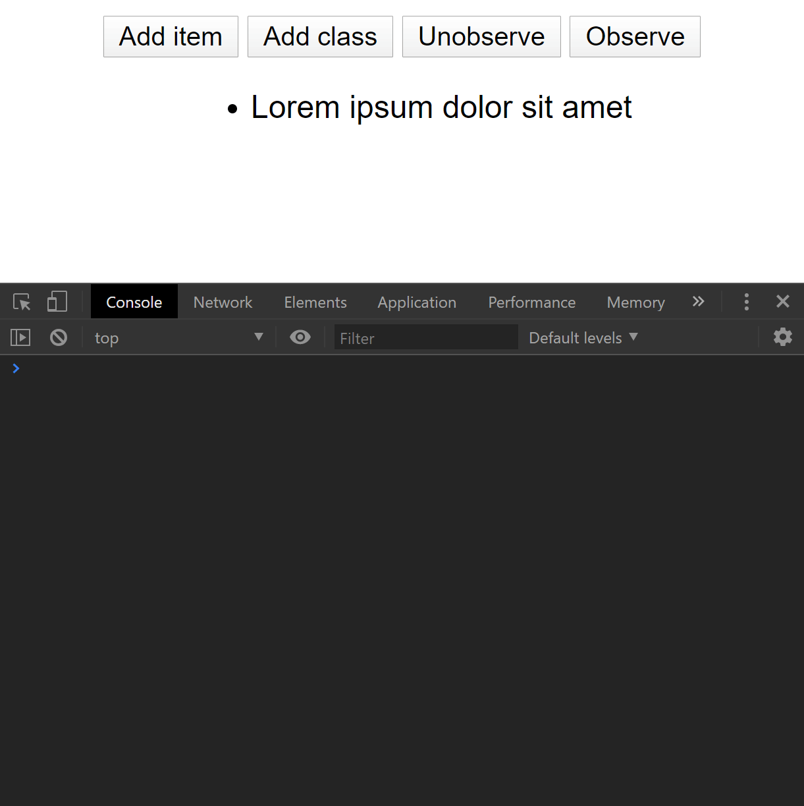
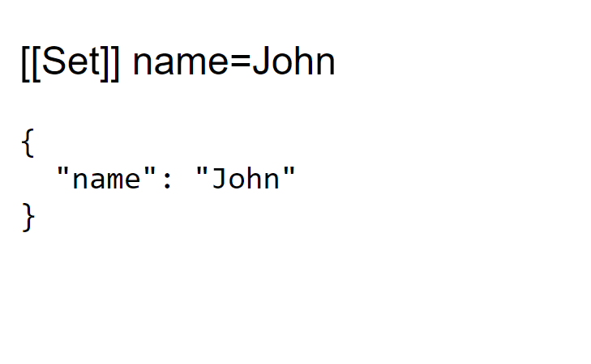

# Talk about Observers, Pipeline operator and Proxy

## [You can see the slides here](https://slides.com/edimitchel/advancedjs-design-pattern#/)

## Observers
- Basic implementation of the design pattern
- Discovery of the `MutationObserver` API

## Pipeline operator
- Discovery of the Pipeline operator `|>` proposal
- Discovery of the Partial application proposal

## Proxy
- Discovery of a Proxy
- Create a function that make an object observable with a Proxy

